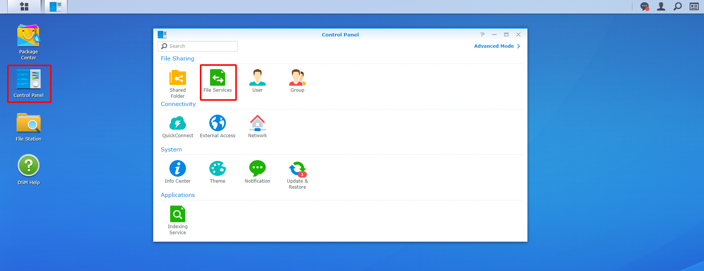
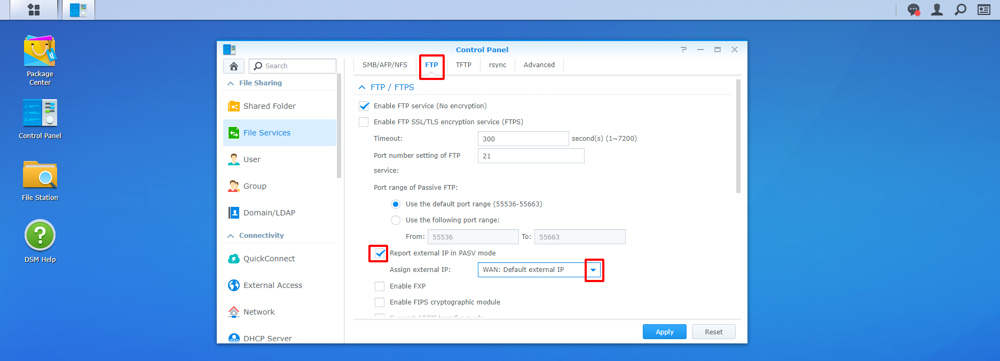
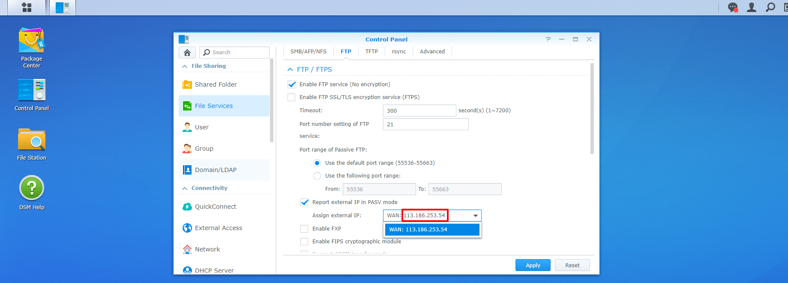
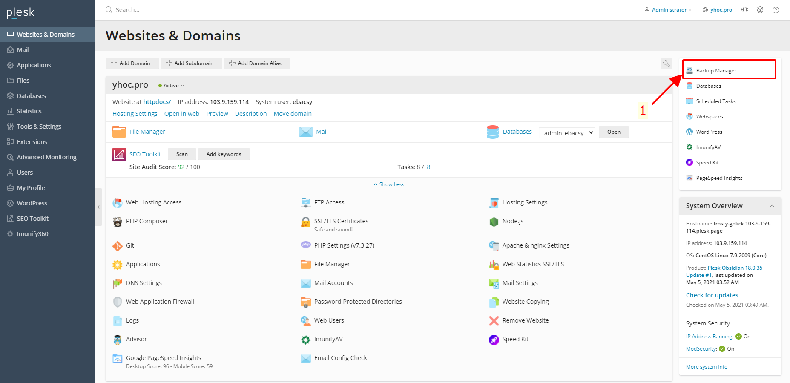
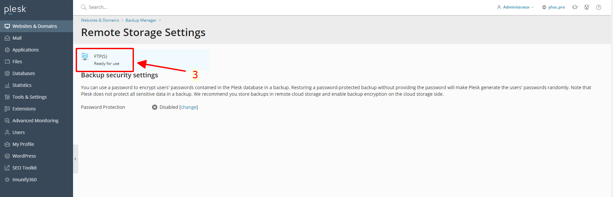
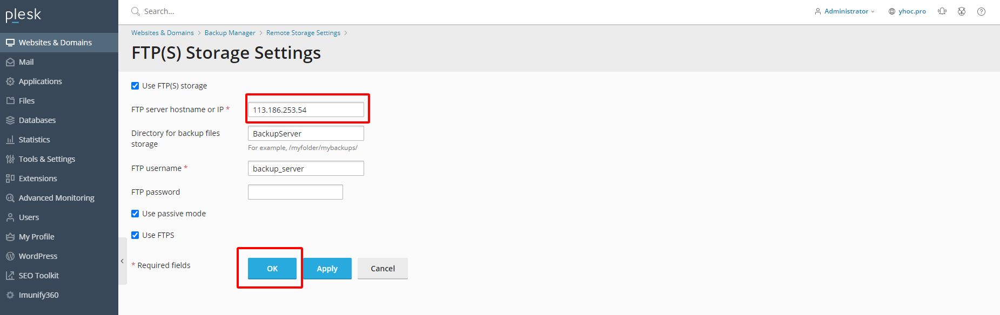

# Chỉnh sửa lại kết nối FTP sau khi NAS mất mạng hoặc mất nguồn

Sau khi tắt hoặc reset modem wifi hoặc sau khi NAS bi mất nguồn thì địa chỉ FTP của NAS bị thay đổi,
nên phải cài lại địa chỉ FTP trên Plesk để backup website không bị lỗi

### 1. Đầu tiên, kiểm tra địa chỉ FTP trên NAS

- Đăng nhập NAS bằng trình duyệt

- Sau khi đăng nhập xong, vào **Control Panel** -> **File Services** -> **FTP**

- Copy địa chỉ FTP của NAS

### 2. Đăng nhập vào Server

- Đăng nhập Server qua Plesk: http://103.9.159.114:8880

- Vào mục **Websites & Domains** -> **Backup Manager**

- Vào **Remote Storage Settings**

- Vào **FTP(S)**

- Đổi lại địa chỉ FTP đã copy ở trên tại mục **FTP server hostname or IP** , sau đó ấn **OK**

